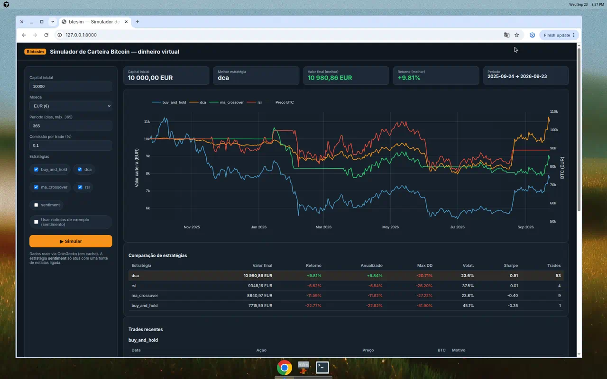
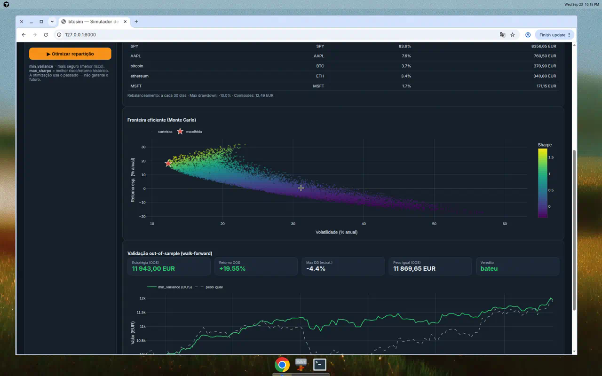
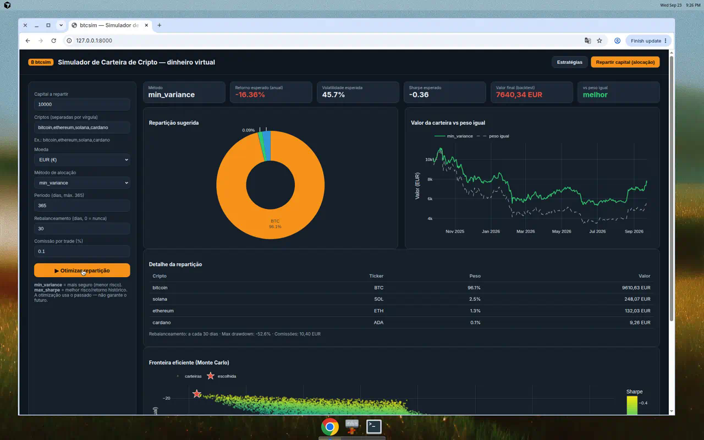

# Bitcoin — Simulador de Gestão de Carteira (`btcsim`)

> ⚠️ **Aviso importante:** isto é uma ferramenta **educativa** que trabalha com
> **dinheiro virtual**. **NÃO é aconselhamento financeiro.** O desempenho passado
> nunca garante resultados futuros. Bitcoin é extremamente volátil — só investe
> dinheiro que estejas disposto a perder e, para decisões reais, fala com um
> profissional certificado.

`btcsim` simula a gestão de uma carteira de **criptomoedas e/ou ações** com
**10 000 €**, testando várias estratégias de compra/venda sobre **dados históricos
reais** e mostrando qual teria tido melhor desempenho — com métricas de risco e um
gráfico. Suporta **qualquer cripto** (Bitcoin, Ethereum, Solana, ...) e **ações/ETFs**
(Apple, Microsoft, S&P 500, ...), inclusive **misturadas** na mesma carteira.

A ideia central: em vez de tentar "adivinhar" quando comprar e vender, defines uma
**estratégia com regras**, e o simulador mostra-te como ela se teria comportado.

## Funcionalidades

- **Cripto e ações**, via *asset specs*:
  - cripto (CoinGecko): `bitcoin`, `ethereum`, `solana`, ... (ou `crypto:bitcoin`);
  - ações/ETFs/índices (Yahoo Finance): `stock:AAPL`, `stock:MSFT`, `stock:SPY`, ...
- **Dados reais**, gratuitos e sem chave: CoinGecko (cripto, até 365 dias),
  Yahoo Finance (ações, histórico longo) e Frankfurter/BCE (câmbio), com cache em
  disco. Também aceita CSV próprio.
- **Conversão cambial automática** das ações (USD) para a tua moeda (ex.: EUR), para
  carteiras mistas consistentes.
- **Validação out-of-sample (walk-forward)** para julgar as estratégias de forma
  honesta e combater o *overfitting*.
- **Intervalo de análise:** **diário** (1 preço de fecho por dia). É a granularidade
  usada para todos os cálculos e sinais; para *backtesting* é a mais robusta.
- **Estratégias incluídas:**
  - `buy_and_hold` — compra tudo no início e mantém (o *benchmark*).
  - `dca` — *Dollar-Cost Averaging*: investe um valor fixo em intervalos regulares.
  - `ma_crossover` — cruzamento de médias móveis (compra/vende nos sinais).
  - `rsi` — compra em sobrevenda (RSI baixo), vende em sobrecompra (RSI alto).
  - `sentiment` — reage a **sentimento de mercado/notícias** (módulo plugável),
    com modo **contrário** opcional (comprar no medo, vender na ganância).
- **Sentimento de mercado real e com histórico** via **Fear & Greed Index**
  (`--news feargreed`): indicador 0–100 que agrega volatilidade, momentum, redes
  sociais e tendências. Gratuito e sem chave.
- **Análise de notícias plugável** (`btcsim/news.py`): índice Fear & Greed, stub
  neutro, análise por palavras-chave a partir do teu CSV de manchetes, ou
  integração com a API da CryptoPanic (sentimento atual, requer `CRYPTOPANIC_TOKEN`).
- **Métricas de desempenho:** retorno total e anualizado, *max drawdown*,
  volatilidade, *Sharpe ratio*, número de trades e comissões pagas.
- **Relatório em texto + gráfico PNG** comparando as estratégias.

## Instalação

```bash
pip install -r requirements.txt
```

## Dashboard interativa (a forma mais fácil de ver)

Arranca a dashboard web e abre no browser:

```bash
python3 -m btcsim.dashboard
# depois abre http://127.0.0.1:8000
```

Na dashboard podes, sem tocar em código:

- escolher o **ativo**: cripto (Bitcoin, Ethereum, ...) ou **ação/ETF** (Apple, S&P 500, ...);
- definir o **capital inicial** (ex.: 10 000 €), a **moeda** e o **período**;
- escolher que **estratégias** comparar (checkboxes);
- escolher a **fonte de sentimento**: nenhuma, **Fear & Greed** (real, do mercado)
  ou notícias de exemplo — com opção de **modo contrário** (comprar no medo,
  vender na ganância);
- ver um **gráfico interativo** das curvas de valor + preço do ativo, os **KPIs**,
  uma **tabela comparativa** (a melhor estratégia fica destacada) e os
  **trades recentes**.

Opções: `--host 0.0.0.0 --port 8080` (útil se quiseres aceder de outra máquina).

## Correr 24 horas no teu servidor

Faz sentido se queres a página **sempre disponível** (telemóvel, portátil, a qualquer hora). O processo fica ligado e responde quando abres o site. As simulações correm quando carregas em **Simular** — não há um robô a comprar ou a vender sozinho. Em repouso usa pouca memória e quase nenhum CPU.

Não preciso de acesso ao servidor. No teu lado, com Docker instalado:

```bash
git clone https://github.com/joaodominguez/Bitcoin.git
cd Bitcoin
git checkout cursor/bitcoin-portfolio-simulator-a499
cp .env.example .env
# edita .env e mete uma password
docker compose up -d --build
```

A dashboard fica em `http://IP-DO-SERVIDOR:8000`. O contentor reinicia sozinho se o servidor reiniciar (`restart: unless-stopped`).

Um segundo processo, `watcher`, corre **de hora a hora**: lê notícias públicas, pode acrescentar cripto ou ações à watchlist, grava uma decisão virtual e envia uma notificação push (ntfy), se `NTFY_TOPIC` estiver definido no `.env`. Não envia ordens a nenhuma corretora.

Um terceiro processo, `tape`, olha o preço do Bitcoin **de 15 em 15 minutos**. Em vez de um preço fixo (ex. 80k), calcula patamares a partir do **máximo dos últimos 30 dias** (−8/−11/−14/−18%), compra fatias de **200 €** virtuais até **1 200 €**, e vende cada fatia só em lucro depois das taxas. Se o mercado estiver perto do topo, fica em **WAIT**. Backtest: `python -m btcsim.tape --backtest --days 180`.
A dashboard mostra a curva do capital vs buy-and-hold **SPY** e **Bitcoin**, um resumo «desde ontem», e o separador **Movimentos** com o histórico completo (carteira + sleeve).

- Define `DASHBOARD_PASSWORD` no `.env`. Sem password, qualquer pessoa que chegue à porta consegue usar a ferramenta e gastar o teu tráfego nas APIs de preços. Com password, o browser abre `/login` (utilizador `DASHBOARD_USER`, por omissão `btcsim`).
- O servidor precisa de saída HTTPS (CoinGecko, Yahoo Finance e câmbio). Cerca de 512 MB de RAM chegam.
- Para um endereço com HTTPS (ex.: `https://carteira.oteudominio.pt`), põe o Nginx ou o Caddy que já tenhas à frente da porta 8000. Não abras a porta 8000 diretamente à internet se puderes evitar.



## Ações e carteiras mistas (cripto + ações)

Além de cripto, podes simular **ações, ETFs e índices** (via Yahoo Finance) usando o
prefixo `stock:`:

```bash
# Uma ação, comparando estratégias
python3 -m btcsim --coin stock:AAPL --compare

# Índice S&P 500 (ETF SPY)
python3 -m btcsim --coin stock:SPY --strategy dca
```

E podes **misturar cripto e ações na mesma carteira otimizada** — muitas vezes o
melhor perfil de risco vem de diversificar entre classes de ativos:

```bash
python3 -m btcsim --allocate \
    --coins "bitcoin,ethereum,stock:AAPL,stock:MSFT,stock:SPY" \
    --method min_variance --rebalance-days 30 --chart output/mix.png
```

Na **dashboard**, o separador de estratégias tem um seletor com secções *Cripto* e
*Ações*, e no separador de alocação basta escrever os ativos separados por vírgula
(ex.: `bitcoin,ethereum,stock:AAPL,stock:SPY`):


> **Conversão cambial automática:** os preços de ações vêm em moeda nativa (USD),
> mas são **convertidos para a tua moeda** (ex.: EUR) usando taxas de câmbio
> históricas reais (BCE, via Frankfurter). Assim as carteiras mistas ficam
> consistentes. Podes desativar com `convert=False` na API.

## Repartir o capital por várias criptos (alocação / diversificação)

Em vez de pôr os 10 000 € numa só cripto, o `btcsim` **reparte-os da melhor forma
possível** por várias, otimizando a carteira sobre dados históricos:

```bash
# Reparte 10.000 € por BTC/ETH/SOL com o método de máximo Sharpe e rebalanceia mensalmente
python3 -m btcsim --allocate --coins bitcoin,ethereum,solana \
    --method max_sharpe --rebalance-days 30 --chart output/alloc.png
```

Métodos de alocação (`--method`):

- `equal` — peso igual (diversificação ingénua, boa referência).
- `inverse_vol` — **paridade de risco**: mais peso às criptos menos voláteis.
- `min_variance` — minimiza o risco total da carteira (mais defensivo).
- `max_sharpe` — melhor relação risco/retorno histórica.

O `min_variance` e o `max_sharpe` usam **otimização por Monte Carlo** (milhares de
repartições possíveis) e o resultado inclui a **fronteira eficiente**.

### Validação out-of-sample (walk-forward)

Otimizar sobre todo o histórico pode enganar (*overfitting*): os pesos parecem
ótimos no passado mas falham à frente. O **walk-forward** resolve isto — otimiza
numa janela de **treino** e avalia na janela de **teste** seguinte (dados nunca
vistos), avançando no tempo. É a forma honesta de julgar uma estratégia:

```bash
python3 -m btcsim --allocate --walk-forward \
    --coins "bitcoin,ethereum,stock:AAPL,stock:MSFT,stock:SPY" \
    --method min_variance --train-days 180 --test-days 30 --chart output/wf.png
```

Compara o resultado **fora da amostra** com uma referência de peso igual. Na
dashboard, ativa a opção *"Validar out-of-sample (walk-forward)"* no separador de
alocação:



Na **dashboard**, o separador *"Repartir capital (alocação)"* mostra a repartição
sugerida (gráfico circular), a curva de valor vs peso igual, a tabela de repartição
e a fronteira eficiente:



> ⚠️ **Nota importante:** a otimização ajusta os pesos ao **passado**. O passado não
> prevê o futuro e otimizar sobre o histórico tem risco de *overfitting* (parecer
> ótimo no passado e falhar à frente). O `min_variance` e a diversificação simples
> costumam ser mais robustos do que perseguir o retorno máximo. Diversifica sempre
> e nunca ponhas tudo numa única aposta.

## Utilização rápida (linha de comandos)

Gerir 10 000 € durante o último ano com DCA (compra semanal):

```bash
python3 -m btcsim --capital 10000 --currency eur --strategy dca --every-days 7
```

Comparar **todas** as estratégias e gerar um gráfico:

```bash
python3 -m btcsim --compare --chart output/compare.png
```

Outra cripto (ex.: Ethereum):

```bash
python3 -m btcsim --coin ethereum --compare --chart output/eth.png
```

Usar sentimento de mercado real (Fear & Greed) em modo **contrário** — comprar
quando há medo, vender quando há ganância:

```bash
python3 -m btcsim --strategy sentiment --news feargreed --contrarian --sent-threshold 0.4
```

Estratégia de cruzamento de médias móveis (SMA 20/50):

```bash
python3 -m btcsim --strategy ma_crossover --short 20 --long 50
```

Estratégia baseada em RSI:

```bash
python3 -m btcsim --strategy rsi --rsi-window 14 --rsi-low 30 --rsi-high 70
```

Estratégia de sentimento a partir de um CSV de notícias (`date,headline`):

```bash
python3 -m btcsim --strategy sentiment --news keyword \
    --news-csv examples/sample_news.csv --sent-threshold 0.2
```

Usar um histórico próprio (CSV com colunas `date,price`):

```bash
python3 -m btcsim --csv o_meu_historico.csv --compare
```

## Exemplo de resultado

Comparação real dos últimos 365 dias (10 000 €), num período em que o BTC **caiu**:

```
  estrategia  valor_final  retorno_%  max_dd_%  sharpe  trades
         dca     10980.86       9.81    -20.71    0.51      53
   sentiment     10000.00       0.00      0.00    0.00       0
         rsi      9348.16      -6.52    -26.20    0.01       4
ma_crossover      8840.97     -11.59    -27.22   -0.40       9
buy_and_hold      7715.59     -22.77    -51.90   -0.35       1
```

Lição ilustrativa: num mercado em queda, o **DCA** (comprar aos poucos ao longo
do tempo) reduziu bastante o *drawdown* face a comprar tudo de uma vez
(*buy & hold*). Isto **não** significa que o DCA ganha sempre — noutros períodos
o *buy & hold* costuma ganhar. É exatamente para isso que serve o simulador:
testar cenários em vez de adivinhar.

## Uso como biblioteca

```python
from btcsim import data
from btcsim.simulator import Simulator
from btcsim.strategies import DCA

series = data.fetch(days=365, currency="eur")
sim = Simulator(series, initial_cash=10_000.0, fee_rate=0.001)
result = sim.run(DCA(every_days=7))

print(result.metrics.as_dict())
print(result.trades)
```

Ver também `examples/run_demo.py`.

## Sobre "acompanhar notícias/sentimento para decidir"

O sentimento é um **ponto de extensão** (`SentimentProvider` em `btcsim/news.py`).
Todos devolvem uma pontuação diária em `[-1, 1]` (negativo = *bearish*, positivo = *bullish*):

- **`FearGreedProvider`** (`--news feargreed`): índice **Medo & Ganância** do mercado
  cripto (alternative.me). É **real, gratuito e com histórico**, por isso funciona em
  *backtests*. Como é do mercado inteiro, aplica-se a qualquer cripto. Combina bem com
  a estratégia de sentimento em **modo contrário** (`--contrarian`).
- **`KeywordSentimentProvider`**: pontua manchetes que tu forneces (CSV `date,headline`).
- **`CryptoPanicProvider`**: sentimento **atual** via CryptoPanic
  (`export CRYPTOPANIC_TOKEN=...`), útil para apoio à decisão no presente.
- **`NeutralProvider`** (por defeito): sentimento 0, não gera trades.

Podes escrever o teu próprio *provider* (ex.: modelo de NLP sobre um feed de notícias,
outra API) implementando `daily_sentiment(index) -> pd.Series` com valores em `[-1, 1]`.

### Nota sobre notícias em tempo real e intervalos

- **Intervalo de preço:** a análise é **diária**. Em janelas curtas a CoinGecko dá
  dados horários, mas o motor de *backtest* usa diário para manter as métricas
  (volatilidade, Sharpe) corretas e comparáveis.
- **Notícias em texto ao minuto:** não há uma fonte histórica gratuita fiável de
  manchetes ao minuto; por isso, para *backtesting* usa-se o Fear & Greed (histórico)
  e, para o **presente**, podes ligar a CryptoPanic ou o teu próprio feed.

## Testes

```bash
python3 -m pytest -q
```

## Estrutura

```
btcsim/
  data.py         # dados de preço: cripto (CoinGecko) + ações (Yahoo) + specs
  indicators.py   # SMA, EMA, RSI, MACD
  portfolio.py    # estado da carteira (cash + BTC, trades, comissões)
  strategies.py   # estratégias de compra/venda
  allocation.py   # repartição/otimização de carteira multi-cripto + rebalanceamento
  news.py         # análise de notícias/sentimento (plugável)
  simulator.py    # motor de backtest
  metrics.py      # métricas de desempenho
  report.py       # relatório em texto + gráfico
  cli.py          # interface de linha de comandos
examples/         # CSV de notícias de exemplo + demo
tests/            # testes (pytest)
```

## Isenção de responsabilidade

Este software é fornecido apenas para fins educativos e de investigação. Nada aqui
constitui aconselhamento financeiro, de investimento ou de qualquer outra natureza.
Os autores não se responsabilizam por quaisquer perdas resultantes do uso desta
ferramenta.
